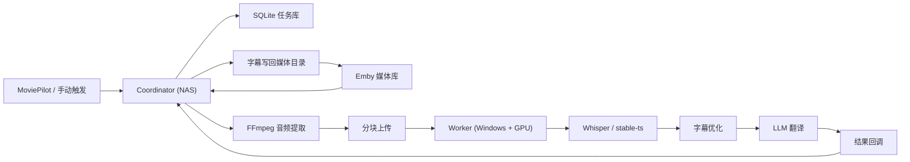

# SSUBB

异地分布式字幕转写翻译项目，面向这样的家庭场景：

- 家里 NAS 负责接收任务、抽音频、写回字幕、对接 Emby / MoviePilot。
- 公司高性能 Windows + NVIDIA GPU 机器 24 小时在线，负责转写、翻译、字幕优化。
- 两端通过 HTTP + 分块上传协同，尽量把重计算从 NAS 剥离出去。

它的本质目标其实很朴素：

- 让我更方便地看那些原本没有字幕、字幕不全、字幕质量差、字幕不同步的电影和电视剧
- 让"补字幕"这件事尽量自动、安静、自然地发生，而不是每次都手动折腾

## 当前版本：V0.5（Worker 客户端化版）

### 已完成

- Coordinator / Worker 双节点拆分已实现。
- SQLite 任务持久化已实现，重启后任务记录不会丢。
- NAS 侧音频提取、Worker 侧转写/翻译/优化主链路已接通。
- 音频通过分块上传到 Worker，具备基础断点续传和哈希校验。
- Worker 可回调 Coordinator 写回字幕。
- 已有字幕检测、跳过逻辑、强制重生成入口。
- 提供 MoviePilot 插件，可在入库后自动触发任务，支持 UI 配置。
- 提供 WebUI 控制台，可查看状态、提交任务、实时日志、文件浏览。
- 提供端到端测试脚本和 smoke test。
- **V0.2**：配置模板 + 状态机重构 + 错误分类 + 重试 + WebUI 详情面板
- **V0.3**：媒体库扫描器 + 定时调度 + 剧集预热 + 去重 + 自动化面板
- **V0.4**：双语字幕 + ASS 格式 + 智能音轨选择 + 跳过逻辑增强
- **V0.5 新增**：
  - MoviePilot 插件 `get_form()`：完整 Vuetify 配置表单（Coordinator 地址、语言、路径映射、开关）。
  - Worker 环境自检 `worker/env_check.py`：启动时自动检查 Python/FFmpeg/CUDA/磁盘/模型/LLM/Coordinator。
  - 模型管理器 `worker/model_manager.py`：Whisper 模型下载/检测/删除/列表，支持 6 种模型规格。
  - 配置引导向导 `worker/setup_wizard.py`：交互式生成 Worker config.yaml，自动检测 GPU。
  - Worker API 扩展：`/api/models`（模型管理）、`/api/env`（环境检查）。
  - 启动器增强：首次启动自动运行配置向导，每次启动执行环境检查。
  - Linux 启动脚本 `worker/run_worker.sh`。

### 下一步（V0.6 方向）

- 多 Worker 调度 / 节点管理 / exe 封装。

## 架构概览

详细版见 [docs/architecture.md](docs/architecture.md)。



## 目录结构

```text
SSUBB/
├─ coordinator/            NAS 侧服务，负责任务编排、抽音频、写字幕、WebUI
├─ worker/                 GPU 侧服务，负责转写、翻译、优化
├─ shared/                 Coordinator / Worker 共用模型和常量
├─ moviepilot-plugin/      MoviePilot 插件
├─ tests/                  Smoke test 和测试脚本
├─ scripts/                环境检查等工具脚本
├─ docs/                   项目文档
├─ data/                   SQLite、日志、临时音频
├─ models/                 Worker 模型目录
├─ config.yaml             当前本地配置
├─ config.example.yaml     脱敏配置示例
├─ docker-compose.yml      Coordinator 容器部署示例
└─ run_e2e_test.py         本地端到端联调脚本
```

## 快速开始

### 1. 准备配置

```bash
# 复制示例配置并编辑必填项
cp config.example.yaml config.yaml
```

必填项（详见 [docs/configuration.md](docs/configuration.md)）：

- `coordinator.worker.url`: Worker 地址
- `worker.coordinator_url`: Coordinator 回调地址
- `worker.llm.*`: LLM API 配置

### 2. 环境检查（Windows）

```powershell
powershell -ExecutionPolicy Bypass -File scripts\check_env.ps1
```

### 3. 启动 Coordinator (NAS)

```bash
docker-compose up -d
```

### 4. 启动 Worker (GPU 机器)

```powershell
# 方式 A: 启动脚本
worker\run_worker.bat

# 方式 B: 手动启动
python -m uvicorn worker.main:app --host 0.0.0.0 --port 8788
```

### 5. 验证

```bash
# 访问 WebUI
http://<nas-ip>:8787/

# 运行 Smoke Test
python tests/smoke_test.py

# 运行端到端测试
python run_e2e_test.py
```

## 组件职责

### Coordinator

部署位置：NAS / 家中常开设备

- 对外暴露 API，接收 MoviePilot、Emby 或手动提交的任务。
- 检查目标字幕是否已存在且质量合格。
- 用 FFmpeg 提取单声道 16k 音频。
- 把音频分块上传给 Worker。
- 接收 Worker 回调结果并写回字幕。
- 刷新 Emby 元数据。
- 提供 WebUI 控制台（任务管理、状态监控、实时日志）。
- 后台巡检：超时检测、任务自愈、Worker 连通性监控。

### Worker

部署位置：公司电脑 / 独显主机

- 接收 Coordinator 上传的音频分块。
- 合并音频并校验哈希。
- 调用 `stable-ts` / `faster-whisper` 做转写。
- 调用 LLM 做断句优化和翻译。
- 把生成的 SRT 回调给 Coordinator。

### MoviePilot 插件

- 监听媒体入库事件。
- 把文件路径和媒体元信息发给 Coordinator。
- 在任务完成或失败后接收回调并通知 MoviePilot。

## API 接口一览

| 方法 | 路径 | 说明 |
|---|---|---|
| POST | `/api/task` | 创建字幕任务 |
| POST | `/api/task/force` | 强制重新生成字幕 |
| GET | `/api/task/{id}` | 查询任务状态 |
| GET | `/api/task/{id}/detail` | 查询任务详情（含阶段耗时） |
| POST | `/api/task/{id}/retry` | 手动重试失败任务 |
| GET | `/api/tasks` | 任务列表（支持状态筛选） |
| POST | `/api/result` | Worker 结果回调 |
| POST | `/api/progress` | Worker 进度更新 |
| GET | `/api/status` | 系统状态 |
| GET | `/api/fs` | 文件系统浏览 |
| GET | `/api/logs` | 服务器日志 |
| POST | `/emby` | Emby Webhook |

## 典型工作流

### 自动触发

1. MoviePilot 入库完成。
2. 插件调用 Coordinator 创建任务。
3. Coordinator 检测字幕并抽取音频。
4. 音频分块发送给 Worker。
5. Worker 转写、优化、翻译。
6. Worker 回调 Coordinator。
7. Coordinator 写回 `video.zh.srt` 并刷新 Emby。

### 手动触发

1. 打开 Coordinator WebUI。
2. 选择媒体路径并提交任务。
3. 在任务列表中观察状态和日志。
4. 失败时点击"重试"按钮。

## 文档

- 架构设计：[docs/architecture.md](docs/architecture.md)
- 配置手册：[docs/configuration.md](docs/configuration.md)
- 发展路线：[docs/roadmap.md](docs/roadmap.md)
- 设计灵感：[docs/inspirations.md](docs/inspirations.md)

## 已知边界

- 目前为单 Worker 架构，不支持多 Worker 调度。
- 异常恢复已有较完整的超时/重试机制，但极端断网场景可能仍需手动干预。
- 配置文件中的敏感信息建议通过环境变量注入。
- 端到端测试依赖真实媒体路径和本地环境。

## 致谢

这个仓库吸收了 `VideoCaptioner`、`subgen` 以及 MoviePilot 插件生态的思路，围绕"家里轻节点 + 异地强节点"的定位进行整合。
