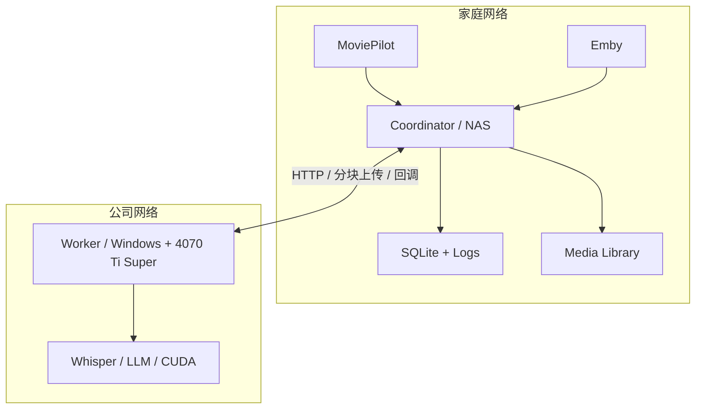
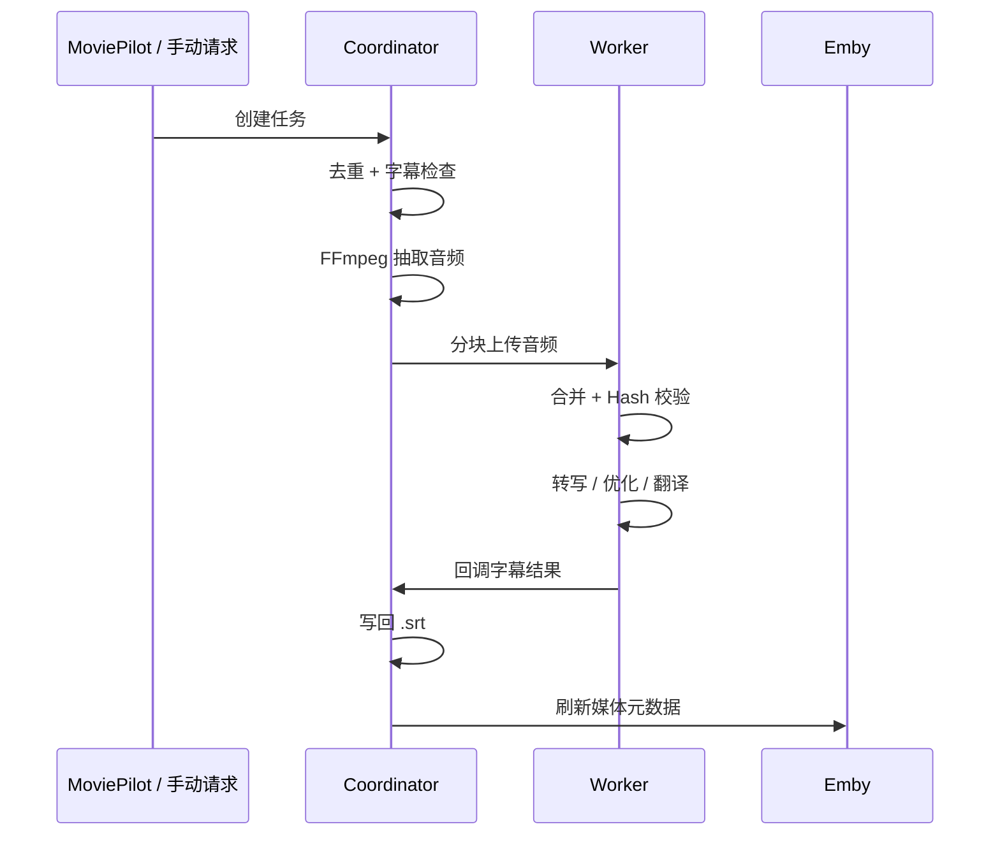

# SSUBB 项目架构

## 1. 设计目标

SSUBB 面向的是“媒体库在家里，算力在异地”的字幕处理场景。

典型前提：

- NAS 挂着 Emby / MoviePilot，保存最终视频和字幕。
- 公司电脑 24 小时开机，带 NVIDIA GPU，适合跑 Whisper 和 LLM。
- 两端可以通过 Tailscale、ZeroTier、VPN 或固定公网地址互联。

设计目标有三个：

1. 让 NAS 只承担轻任务。
2. 让 GPU 机器只承担重任务。
3. 字幕结果最终仍然回到媒体库本地，兼容现有观影工作流。

## 2. 逻辑分层

### 2.1 接入层

入口有三种：

- MoviePilot 插件自动触发
- Emby webhook 触发
- WebUI / API 手动触发

这一层只负责“把媒体文件变成任务请求”。

### 2.2 编排层

`Coordinator` 是整个系统的大脑，负责：

- 任务去重
- 字幕存在性和质量检查
- 音频提取
- 上传 Worker
- 接收回调
- 写回字幕
- 刷新 Emby

这里也是项目最适合继续扩展的地方，例如后续做多 Worker、重试策略、任务优先级，基本都落在这一层。

### 2.3 执行层

`Worker` 是纯计算节点，负责：

- 接收音频分块
- 合并音频
- 调用 ASR 模型
- 调用 LLM 做优化和翻译
- 回调结果

它的目标是尽量“无状态”。现在虽然还有临时目录和队列，但总体方向是对的。

从中长期演进看，`Worker` 不一定只是一段后台服务，它也可以继续封装成“客户端节点”：

- 外部是桌面启动器或 launcher
- 内部仍然是当前 Worker 服务内核
- 启动器负责环境检测、模型下载、配置引导和服务拉起

这样会更符合“异地算力节点”的实际使用场景。

### 2.4 存储层

当前主要存储包括：

- `SQLite`: 任务状态和历史记录
- `data/audio_temp`: Coordinator 抽取的临时音频
- `data/worker_temp`: Worker 合并音频后的临时文件
- 媒体目录中的 `.srt`: 最终产物

## 3. 节点拓扑

## 4. 时序流程

## 5. 模块职责拆解

### 5.1 `coordinator/`

核心模块：

- `main.py`: FastAPI 入口、API 暴露、WebUI 挂载
- `task_manager.py`: 任务生命周期和主流程编排
- `task_store.py`: SQLite 持久化
- `audio_extractor.py`: FFmpeg 抽音频
- `subtitle_checker.py`: 检测已有字幕是否可复用
- `subtitle_writer.py`: 写回字幕并刷新 Emby
- `worker_client.py`: 上传 Worker、查询状态

适合继续演进的方向：

- 多 Worker 调度
- 更严格的状态机
- 更清晰的重试与恢复

### 5.2 `worker/`

核心模块：

- `main.py`: FastAPI 入口、分块接收、队列处理
- `task_executor.py`: 转写、优化、翻译主链路
- `llm_client.py`: LLM 调用封装
- `optimizer.py`: 字幕优化
- `translator.py`: 字幕翻译
- `health.py`: Worker 健康状态

适合继续演进的方向：

- 队列优先级
- 取消任务
- 模型常驻与复用
- 更细粒度的进度上报
- 客户端化封装，提供更低门槛的部署和迁移体验

### 5.4 `worker-launcher/`（未来方向）

如果后续推进 Worker 客户端化，建议单独引入一个 `worker-launcher/` 或类似模块，作为桌面启动器层。

建议职责：

- 启动前环境检查
- CUDA / 显卡 / 端口 / 网络状态检测
- 模型下载、校验和缓存目录管理
- Worker 配置初始化与升级
- 启动、停止、重启 Worker 服务
- 展示基础状态、日志和错误提示

这样可以把“部署体验”与“计算内核”解耦，避免把所有 UI / 启动逻辑直接塞进当前 Worker 服务里。

### 5.3 `moviepilot-plugin/`

定位：

- 不是核心处理节点，而是自动化入口适配层。
- 把 MoviePilot 的媒体事件翻译成 SSUBB 任务请求。
- 接收结果回调，并向 MoviePilot 发通知。

## 6. 状态机建议

当前代码里已经有这些状态：

- `pending`
- `extracting`
- `uploading`
- `transcribing`
- `optimizing`
- `translating`
- `aligning`
- `completed`
- `failed`
- `skipped`
- `cancelled`

从架构角度，后续建议把它明确分为四个阶段：

1. Coordinator 本地阶段
2. 传输阶段
3. Worker 执行阶段
4. 回收阶段

这样好处是：

- 更容易判断任务到底卡在哪一段
- 更容易做重试策略
- 更容易做 UI 展示和统计

## 7. 当前成熟度判断

### 已经具备原型可用性

- 单 Worker 场景下，主流程是连通的。
- 任务数据已持久化，不是内存玩具。
- 有基本的 UI、日志、插件、回调能力。

### 还没达到稳定生产级

- 自动恢复策略还不够严谨。
- 部署脚本和文档还没有完全标准化。
- 配置安全、可观测性、错误分类还有明显提升空间。
- 目前更适合“自己维护、自己使用”，不适合直接开源给外部用户无脑部署。

### 但存在很清晰的升级路径

- Coordinator 继续朝“调度与编排中心”发展
- Worker 继续朝“可分发的算力客户端”发展
- 二者之间保持稳定的 HTTP / 回调协议

这条路线有利于后面逐步支持多节点、迁移接管和更低门槛部署。

## 8. 推荐的下一步演进

### P1

- 补 `config.example.yaml`
- 统一环境变量注入方式
- 校正 `docker-compose`、README、启动脚本的描述

### P2

- 完善任务恢复和超时机制
- 补跨节点 smoke test
- 增加任务详情页和失败原因分类
- 输出 Worker 客户端化设计稿，明确 launcher 与内核边界

### P3

- 支持多 Worker
- 支持不同模型和翻译策略路由
- 补通知、告警、统计面板
- 推进 Worker launcher / exe 分发形态

## 9. 结论

SSUBB 现在最有价值的地方，不是“做字幕”本身，而是它已经把你的实际家庭环境抽象成了一个明确架构：

- 家里保存资产和负责接入
- 异地机器负责算力
- 中间通过简单稳定的 HTTP 协议解耦

这条路线是成立的。后续只要继续把部署、恢复和配置安全补齐，它就会从“能跑的个人项目”慢慢变成“可长期依赖的家庭媒体基础设施”。
