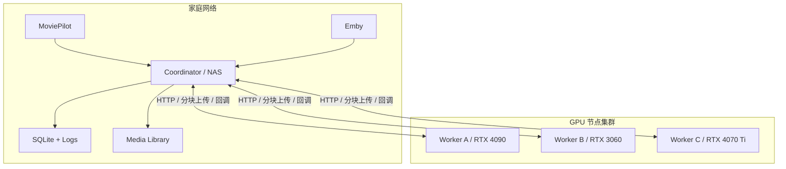
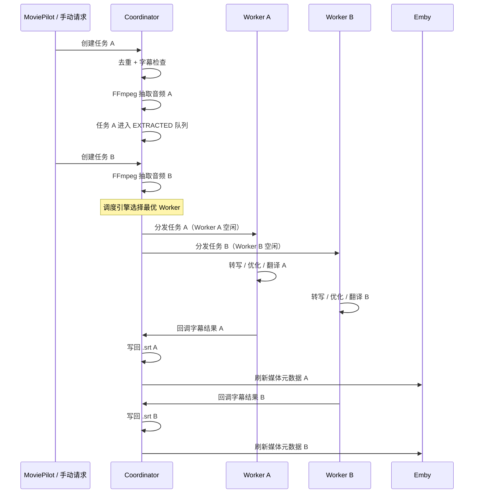
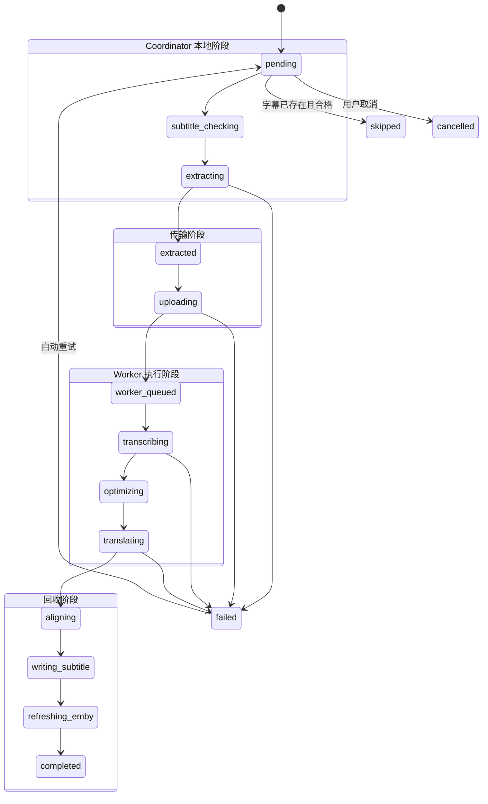
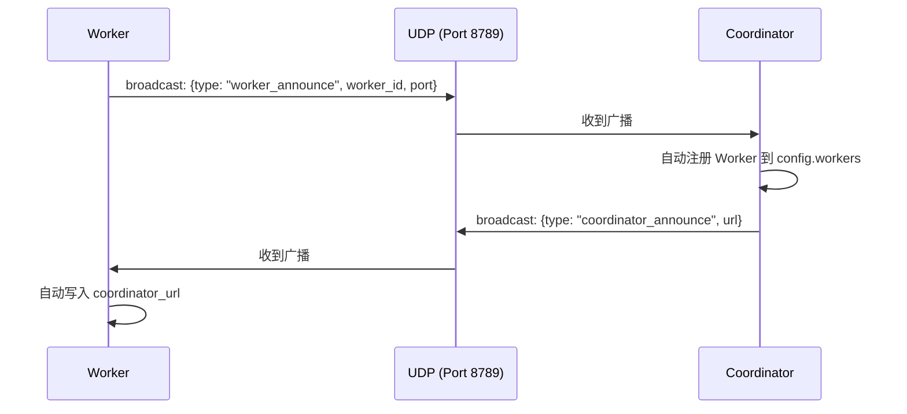

# SSUBB 项目架构

## 1. 设计目标

SSUBB 面向的是"媒体库在家里，算力在异地"的字幕处理场景。

典型前提：

- NAS 挂着 Emby / MoviePilot，保存最终视频和字幕。
- 公司电脑 24 小时开机，带 NVIDIA GPU，适合跑 Whisper 和 LLM。
- 两端可以通过 Tailscale、ZeroTier、VPN 或固定公网地址互联。

设计目标有三个：

1. 让 NAS 只承担轻任务。
2. 让 GPU 机器只承担重任务。
3. 字幕结果最终仍然回到媒体库本地，兼容现有观影工作流。

## 2. 逻辑分层

### 2.1 接入层

入口有三种：

- MoviePilot 插件自动触发
- Emby webhook 触发
- WebUI / API 手动触发

这一层只负责"把媒体文件变成任务请求"。

### 2.2 编排层

`Coordinator` 是整个系统的大脑，负责：

- 任务去重
- 字幕存在性和质量检查
- 音频提取
- Worker 调度与分发
- 接收回调
- 写回字幕
- 刷新 Emby

V0.6 起，编排层引入了 **Worker Registry** 和 **调度引擎**，支持多节点并发。

### 2.3 执行层

`Worker` 是纯计算节点，负责：

- 接收音频分块
- 合并音频
- 调用 ASR 模型
- 调用 LLM 做优化和翻译
- 回调结果

它的目标是尽量"无状态"。现在虽然还有临时目录和队列，但总体方向是对的。

从中长期演进看，`Worker` 不一定只是一段后台服务，它也可以继续封装成"客户端节点"：

- 外部是桌面启动器或 launcher
- 内部仍然是当前 Worker 服务内核
- 启动器负责环境检测、模型下载、配置引导和服务拉起

### 2.4 存储层

当前主要存储包括：

- `SQLite`: 任务状态和历史记录
- `data/audio_temp`: Coordinator 抽取的临时音频
- `data/worker_temp`: Worker 合并音频后的临时文件
- 媒体目录中的 `.srt`: 最终产物

## 3. 节点拓扑 (V0.6 多节点)



## 4. 时序流程 (V0.6 流水线)



## 5. 模块职责拆解

### 5.1 `coordinator/`

核心模块：

- `main.py`: FastAPI 入口、API 暴露、WebUI 挂载
- `task_manager.py`: 任务生命周期、流水线编排、Worker 调度
- `task_store.py`: SQLite 持久化
- `audio_extractor.py`: FFmpeg 抽音频
- `subtitle_checker.py`: 检测已有字幕是否可复用
- `subtitle_writer.py`: 写回字幕并刷新 Emby
- `worker_client.py`: 单个 Worker 的 HTTP 通信封装
- `worker_registry.py`: 多 Worker 注册中心（V0.6 新增）
- `scheduler.py`: 定时扫描与任务触发
- `config.py`: 配置加载与校验

### 5.2 `worker/`

核心模块：

- `main.py`: FastAPI 入口、分块接收、队列处理
- `task_executor.py`: 转写、优化、翻译主链路
- `llm_client.py`: LLM 调用封装
- `optimizer.py`: 字幕优化
- `translator.py`: 字幕翻译
- `health.py`: Worker 健康状态

适合继续演进的方向：

- 队列优先级
- 取消任务
- 模型常驻与复用
- 更细粒度的进度上报
- 客户端化封装，提供更低门槛的部署和迁移体验

### 5.3 `moviepilot-plugin/`

定位：

- 不是核心处理节点，而是自动化入口适配层。
- 把 MoviePilot 的媒体事件翻译成 SSUBB 任务请求。
- 接收结果回调，并向 MoviePilot 发通知。

### 5.4 `worker-launcher/`（未来方向）

如果后续推进 Worker 客户端化，建议单独引入一个 `worker-launcher/` 或类似模块，作为桌面启动器层。

建议职责：

- 启动前环境检查
- CUDA / 显卡 / 端口 / 网络状态检测
- 模型下载、校验和缓存目录管理
- Worker 配置初始化与升级
- 启动、停止、重启 Worker 服务
- 展示基础状态、日志和错误提示

## 6. 状态机 (V0.6)

当前任务状态分为四个阶段：



| 阶段 | 包含状态 | 说明 |
|---|---|---|
| Coordinator 本地 | `pending` → `subtitle_checking` → `extracting` → `extracted` | 音频提取完成，等待分发 |
| 传输 | `uploading` → `worker_queued` | 音频上传至 Worker |
| Worker 执行 | `transcribing` → `optimizing` → `translating` → `aligning` | AI 处理链路 |
| 回收 | `writing_subtitle` → `refreshing_emby` → `completed` | 结果写回 |

## 7. 关键设计决策

### 7.1 Worker Registry 模式 (V0.6)

Coordinator 通过 `WorkerRegistry` 统一管理所有 Worker 节点：

- 后台心跳轮询（默认 30 秒间隔），自动检测节点上下线
- 超时未响应（默认 300 秒）自动标记为离线
- 支持配置热重载，增减节点无需重启服务
- 向后兼容：旧单 Worker 配置自动迁移为单元素列表

### 7.2 加权最少连接调度 (V0.6)

任务分发采用加权最少连接算法：

1. 优先选择空闲 Worker
2. 多个空闲时，按权重降序排列（权重越高越优先）
3. 都忙碌时，选择队列最短的 Worker
4. 提交失败时自动 fallback 到下一个可用节点

### 7.3 提取-分发流水线 (V0.6)

将 CPU 密集的音频提取与网络密集的 Worker 分发解耦：

- `asyncio.Semaphore(2)` 限制并发提取数，防止磁盘 I/O 过载
- 提取完成后进入 `EXTRACTED` 状态，由后台 `_dispatch_loop` 每 5 秒扫描并分发
- 多个任务的提取和转写可重叠进行，显著提升批量吞吐量

### 7.4 WebUI 与零配置驱动 (V0.5)

- **NAS 端 (Coordinator)**：Docker 启动时未提供配置文件，系统进入 `SETUP_REQUIRED` 模式，WebUI 自动弹出配置向导。
- **GPU 端 (Worker)**：启动脚本自动引导环境检测（CUDA/FFmpeg）、交互式请求 LLM API Key，并在后台自动拉取 Whisper 模型。

### 7.5 健壮的重试与恢复机制 (V0.2+)

- **细粒度超时**：不同阶段具有独立的超时重置（例如，翻译阶段为半小时，转写阶段为一小时）。
- **任务防重**：同一物理文件的重复请求将被 Coordinator 在入口处直接拦截。
- **错误分类**：区分可重试错误（网络、超时）与不可重试错误（配置、模型），实现智能恢复。

### 7.6 局域网自动发现 (V0.7)

通过 UDP 广播实现零配置互联：



- 协议：JSON over UDP, port 8789
- 广播间隔：30 秒
- Docker 注意：需要 `--network host` 或映射 UDP 端口
- 可通过 `SSUBB_DISCOVERY_ENABLED=false` 关闭

### 7.7 WebSocket 日志流 (V0.7)

替代轮询的实时日志推送方案：

- `LogBroadcaster` 维护内存中的日志历史（deque, max 200 条）和 WebSocket 订阅者集合
- `WebSocketLogHandler` 注册到 root logger，每条日志自动广播
- `/ws/logs` WebSocket 端点：连接时先发送历史，再实时推送新日志
- 前端自动重连（指数退避，最大 30 秒）
- REST `/api/logs` 保留作为 fallback

### 7.8 配置健康度 (V0.7)

`GET /api/health` 端点评估配置完整性：

- 检查项：Worker 已配置、Worker 在线、Emby 配置、自动化配置
- 返回 0-100 分值和具体建议
- WebUI Header 显示健康度圆环，低于 100% 时可点击查看详细建议

### 7.9 任务优先级队列 (V0.8)

任务支持 1-5 级优先级（1=最高，5=默认），调度器在分发时按优先级升序排列：

- `TaskCreate.priority` 和 `TaskInfo.priority` 字段
- SQLite `tasks.priority` 列，`ORDER BY priority ASC, created_at DESC`
- API `POST /api/task/{id}/priority` 允许修改 pending 任务优先级
- WebUI 提交任务时可选择优先级，任务列表用颜色区分（红=高，黄=普通，灰=低）

### 7.10 自适应调度权重 (V0.8)

`WorkerRegistry` 追踪每个 Worker 最近 20 次任务的处理速率（媒体分钟/实际分钟），自动调整权重：

```python
rate = media_duration_min / (wall_time_sec / 60)
factor = clamp(worker_avg_rate / global_avg_rate, 0.5, 2.0)
adaptive_weight = config_weight * factor
```

调度算法从纯配置权重升级为 `adaptive_weight`，高性能 Worker 自动获得更多任务。

### 7.11 自动故障迁移 (V0.8)

`_watch_loop` 每次巡检时调用 `_migrate_offline_tasks()`：

- 获取所有已分配 Worker 的活跃任务（`WORKER_STAGES` 中且 `worker_id IS NOT NULL`）
- 检查 `worker_id` 是否仍在在线 Worker 列表中
- 离线 Worker 的任务自动重置为 PENDING 并重新走处理流程

### 7.12 字幕质量评分 (V0.8)

`SubtitleChecker.score_subtitle()` 对生成的 SRT 字幕进行五维度评分（满分 100）：

| 维度 | 分值 | 说明 |
|------|------|------|
| 覆盖率 | 30 | 字幕时间覆盖视频时长的比例 |
| 密度 | 20 | 每分钟字幕条数（理想: 3-15） |
| 行长合理性 | 20 | 过长(>50字)/过短(<3字)行比例 |
| 时间连续性 | 15 | 最大间隔、重叠检测 |
| 内容质量 | 15 | 空白行、重复行检测 |

等级: A(≥90), B(≥75), C(≥60), D(≥40), F(<40)。评分 < 40 自动触发重试。

### 7.13 可靠性设计 (V0.9)

#### 异常安全的后台任务

所有 `asyncio.create_task()` 调用统一使用 `_safe_background_task()` 包装，确保异常被记录而非静默丢弃：

```python
def _safe_background_task(coro, label: str = "background"):
    async def _wrapper():
        try:
            await coro
        except Exception as e:
            logger.error(f"[{label}] 后台任务异常: {e}", exc_info=True)
    return asyncio.create_task(_wrapper())
```

#### Whisper 模型缓存

Worker 端 Whisper 模型采用模块级单例缓存，首次加载后复用，避免每任务 30-60s 重载开销：

```python
_cached_model: Optional[WhisperModel] = None
_cached_model_key: str = ""

def _get_whisper_model(self) -> WhisperModel:
    key = f"{model_path}|{device}|{compute_type}"
    if _cached_model is not None and _cached_model_key == key:
        return _cached_model
    # 加载新模型并缓存
```

#### 翻译失败检测

翻译器返回 `tuple[Optional[str], dict]`，其中 dict 包含 `translated_count`、`total_count`、`partial` 统计信息。全部批次失败时返回 `(None, stats)`，触发任务重试；部分失败时标记 `partial=True`。

#### 时区统一

调度器使用 `zoneinfo.ZoneInfo(config.automation.timezone)` 做本地时间比较，解决非 UTC 时区用户调度窗口错位问题。

### 7.14 批量操作 (V0.9)

提供任务级批量操作能力：

- **API 层**：`POST /api/tasks/batch/{retry,cancel,delete}`，请求体 `{"task_ids": [...]}`, 返回 `{"affected": N}`
- **存储层**：`TaskStore.get_tasks_by_ids()`, `batch_update_status()`, `batch_delete()`
- **WebUI 层**：任务列表每行 checkbox + 表头全选，选中后底部浮动操作栏

### 7.15 数据洞察 (V0.9)

SQLite 统计查询 + WebUI 可视化：

```python
def get_statistics(self, days: int = 30) -> dict:
    """返回: total, completed, failed, success_rate, avg_duration_sec, by_status, by_day"""
def get_worker_statistics(self) -> dict:
    """返回: 每个 worker 的 total, completed, failed, success_rate"""
```

WebUI 设置面板「数据洞察」tab 展示：
- 最近 7 天任务趋势（SVG 柱状图）
- 成功率卡片
- 平均耗时
- Worker 利用率

### 7.16 安全加固 (V0.9)

- **路径遍历防护**：`/api/fs` 端点使用 `Path.resolve()` + `startswith()` 校验，禁止 `..` 和符号链接跳出
- **文件名净化**：Worker `X-File-Name` header 经 `os.path.basename()` 提取，禁止 `/`, `\`, `..`，限长 255
- **配置并发锁**：`PUT /api/config` 使用 `asyncio.Lock()` 防止并发写入损坏

### 7.17 通用 Webhook 接口 (V0.8)

`POST /api/webhook` 提供标准化的任务创建入口：

- 支持 JSON 和 form-urlencoded
- 必填: `media_path`
- 可选: `media_title`, `media_type`, `target_lang`, `priority`, `callback_url`
- Token 认证: 配置 `webhook.token` 后需在 Header 传 `X-SSUBB-Token`

## 8. 未来演进方向

SSUBB 的核心价值是将家庭环境抽象成明确且高度解耦的架构：

- **NAS**：保存核心资产和接管前端交互。
- **异地 Worker 集群**：承接重型 AI 算力，支持弹性扩缩。
- **HTTP/JSON**：两者之间通过简单稳定的短连接协议解耦。

V0.7 已实现：

1. **零配置体验**：局域网 UDP 广播自动发现，Coordinator 和 Worker 免配置互联。
2. **WebUI 体验升级**：Toast 通知、确认对话框、简单/高级模式、WebSocket 实时日志。
3. **配置健康度**：实时评估配置完整性，引导用户逐步完善。
4. **移动端适配**：响应式卡片布局、触控优化、无障碍支持。

V0.8 已实现：

1. **任务优先级队列**：1-5 级优先级，调度器按优先级排序分发。
2. **自适应权重**：WorkerRegistry 追踪历史处理速率，自动调整调度权重。
3. **自动故障迁移**：`_watch_loop` 检测离线 Worker 后自动迁移其活跃任务。
4. **字幕质量评分**：`SubtitleChecker.score_subtitle()` 从覆盖率、密度、行长、连续性、内容五维度评分。
5. **通用 Webhook**：`POST /api/webhook` 标准化入口，支持 Token 认证。
6. **API 文档**：Swagger UI (`/docs`) + ReDoc (`/redoc`)，所有路由按功能分组。

V0.9 已实现：

1. **可靠性修复**：时区统一（`zoneinfo.ZoneInfo`）、SQL 注入修复（参数化查询）、`_safe_background_task()` 包装所有 fire-and-forget 任务、惊群效应修复（移除 `_watch_loop` 批量重试 pending）。
2. **Worker 可靠性**：Whisper 模型模块级单例缓存、翻译失败检测与 partial 标记、httpx 共享客户端生命周期管理、临时文件自动清理、取消端点真实实现。
3. **WebUI 体验打磨**：Escape 键关闭弹窗、Windows 路径修复、API 错误详情 Toast、任务列表分页、确认弹窗焦点陷阱。
4. **批量操作**：checkbox 多选 + 浮动操作栏 + 后端批量 API（retry/cancel/delete）。
5. **数据洞察**：SQLite 统计查询 + WebUI 设置面板「数据洞察」tab（7 天趋势图、成功率、Worker 利用率）。
6. **安全加固**：路径遍历防护、文件名净化、配置更新并发锁。
7. **心跳并行化**：`asyncio.gather()` 并行检查所有 Worker 心跳。

V0.10 已实现：

1. **LLM 多端点容灾**：支持配置多个 LLM 提供商（DeepSeek/OpenAI/智谱等），按优先级自动切换，单点故障不再影响全局。
2. **字幕预览与编辑**：完成任务后可在 WebUI 预览/编辑 SRT 字幕，支持勾选段落重新优化。
3. **字幕命名规范化**：ISO 639-2/B 三字母码 + `.ssubb` 标识 + `.forced` 双语标记。
4. **反思翻译**：`need_reflect` 配置项生效，翻译后可选二次审校。
5. **自动段落修复**：质量评分 < 60 自动扫描异常段落定点修复。
6. **配置单入口**：Coordinator 推送全局配置到 Worker，用户无需两边跑。
7. **看板健康条**：紧凑的系统状态条替代 4 个统计卡片。
8. **任务搜索 & 键盘快捷键**：搜索框实时过滤，Ctrl+F/Ctrl+Enter 快捷操作。

### 7.18 LLM 多端点容灾 (V0.10)

Worker 端支持配置多个 LLM 提供商，按优先级自动切换：

```python
class LLMClient:
    def __init__(self, providers: list[LLMProviderConfig]):
        self._providers = sorted(
            [p for p in providers if p.enabled],
            key=lambda p: p.priority
        )
        self._clients: dict[str, AsyncOpenAI] = {}
        self._health: dict[str, LLMHealthStatus] = {}

    async def chat_completion(self, messages, **kwargs):
        for provider in self._providers:
            try:
                resp = await self._clients[provider.label].chat.completions.create(...)
                self._health[provider.label] = LLMHealthStatus(healthy=True, ...)
                return resp
            except Exception as e:
                self._health[provider.label] = LLMHealthStatus(healthy=False, ...)
                continue
        return None
```

- 每个 provider 拥有独立的 `AsyncOpenAI` 实例和健康状态追踪
- `chat_completion()` 按优先级遍历，首个成功即返回
- `check_health()` 轻量检测所有 provider 连通性（max_tokens=1）
- Coordinator 通过 `/api/llm/health` 代理查询 Worker 的 LLM 健康状态
- 配置通过 Coordinator WebUI 统一管理，自动推送到所有在线 Worker

### 7.19 字幕预览与编辑 (V0.10)

任务完成后，字幕内容持久化到 SQLite `task_subtitles` 表，支持：

- **预览模式**：结构化展示 SRT 条目（时间轴 + 文本），带 checkbox 选段
- **编辑模式**：monospace textarea 直接编辑 SRT 原文
- **部分重新优化**：勾选段落 → 发送到 Worker → 带滑动上下文窗口（前后各 5 条）重新调用 LLM
- **自动段落修复**：质量评分 < 60 时自动扫描异常段落（过短/过长/错误标记），定点修复

### 7.20 配置同步 (V0.10)

用户只在 Coordinator WebUI 配置，Coordinator 自动推送到 Worker：

- **全局配置**（推送到 Worker）：`llm_providers`, `translate`, `optimize`
- **节点配置**（Worker 本地）：`transcribe`, `vram`（硬件相关，不适合全局）
- Worker 新增 `PUT /api/config` 端点接收推送，热重载 LLM 客户端
- 向后兼容：旧 `llm` 单配置自动迁移为 `llm_providers` 单元素列表
